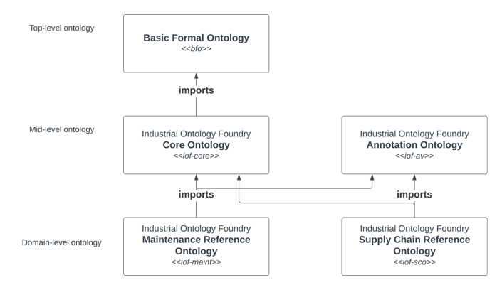
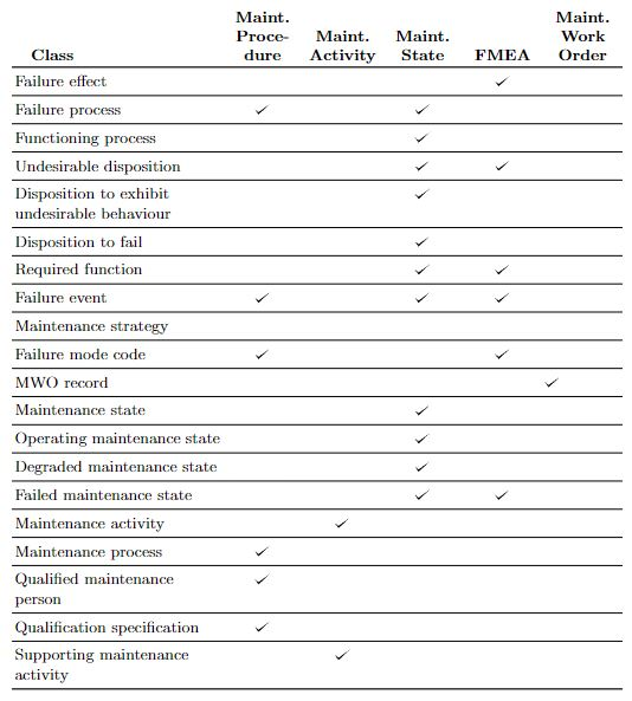
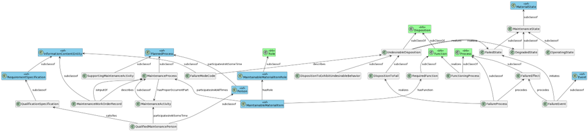
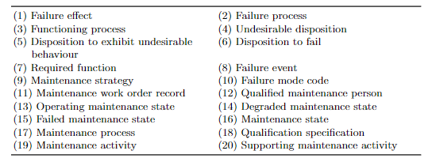
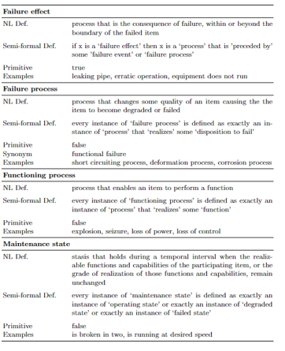
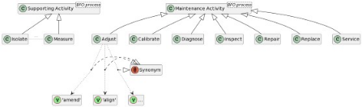

## IOF Maintenance Ontology Class

In this class we provide an overview of the IOF-aligned Maintenance Reference ontology and demonstrate its application on a use case based on the maintenance activity application ontology.

There are two main resources for this class. Introductions, framing and the slides for Part 3 are in powerpoint slides. These are available to download as the raw file [here](powerpoint/IOF-maintenance-workshop-2024.pptx)

## Part 1: Overview of the Maintenance Reference Ontology

### IOF-maint ontology resources

It will be helpful for participants to access and look at the ontology resources used in this tutorial. These are available on line as follows.

1. The **IOF website** hosting the IOF CORE, IOF supply chain and IOF maintenance ontologies

IOF GitHub: https://spec.industrialontologies.org/iof/

IOF Viewer: https://spec.industrialontologies.org/iof/ontology/

Direct link to the maintenance reference ontology: https://spec.industrialontologies.org/iof/ontology/maintenance/MaintenanceReferenceOntology/

2. The **Ontocommons website** and its metadata on ontologies as well as useful visualisations and search features on IOF-aligned maintenance ontologies

Maintenance reference ontology: https://spec.industrialontologies.org/iof/ontology/maintenance/MaintenanceReferenceOntology/

Maintenance activity ontology: https://industryportal.enit.fr/ontologies/MNT-ACT?p=summary

Maintenance procedure documentation ontology: https://industryportal.enit.fr/ontologies/OMPD-CMTO?p=summary

Note the FAIR scores available for each, a licence, a hyperlink to the source, and a figure.

#### Where does iof-maint 'fit' in IOF?

Iof-maint is based on five use cases documented in peer-reviewed publications. See list in references at the end of this notebook.

Each use case describes an application ontology and is supported by industrial data produced in the maintenance management process.

20 classes and 2 object properties used in multiple use cases (or considered central to maintenance management) are 'lifted' to the iof-maint reference ontology to be used as a common resource.

### ido-maint: Maintenance reference ontology overview

The iof-maint ontology can be visualised below

Note that two terms crucial to maintenance, namely `MaintainableMaterialItem' and 'MaintainableMaterialItemRole' are not shown here as they have been 'lifted' into IOF Core.

Summary list of terms

### Example of documentation in iof-maint

All terms and their documentation are at https://spec.industrialontologies.org/iof/ontology/maintenance/MaintenanceReferenceOntology/

An example of documentation for a single term is below.

## Part 2: Use case - Maintenance activity ontology

Framing of the use case

We will use the maintenance activity ontology and show how it can be used for monitoring the reliability of a pump. This could be e.g a lubrication or cooling water pump on some piece of manufacturing equipment used in producing the engine or for a jet engine oil system.

The use case is an instanciation of material described in a Semantic Web Journal paper `An ontology for maintenance activities and its application to data quality'.

### Use of the ontology for data quality control

We use natural language processing to identify seven core maintenance activity terms and their synonyms from 800,000 MWOs (maintenance work orders).

These seven terms are captured in the image below

We provide elucidations for these seven terms. An example is for the term 'replace' is below:

SME description: Replacement of an item by a new or refurbished item of the same type and make.

Semi-formal description: A BFO: Process in which one item is removed and another item with the same required function is installed in its place.

Elucidation: p is a replace activity = Def. p is a process and there exist material artifacts a and b (a $\not=$ b) such that a and b participate in p at some time. The following is also true:

- a has a function f and b has a function f2.

- f and f2 are of type F

- a is a continuant part of a system s at time t and b is not.

- b is a continuant part of a system s at time t2 and a is not.

- p occurs at some time tp

- t precedes t2, tp finishes t and tp starts t2

The end-to-end NLP-ontology pipeline identifies data quality issues with 55% of the MWO records for a centrifugal pump over 8 years.

For the 33% of records where a verb was not provided in the unstructured text, the ontology can infer a relevant activity class.

First we will **look at the paper online**. A copy of the paper is available

https://content.iospress.com/articles/semantic-web/sw233299?resultNumber=0&totalResults=10&start=0&q=hodkiewicz&resultsPageSize=10&rows=10

Following this we will **examine code for importing the data and building the ontology in a Google Colab** https://colab.research.google.com/drive/1gVgtC-JcXikNPzpp8p1wIGstF0EEnwBl?usp=sharing

A link to the GitHub file for the paper is

https://github.com/uwasystemhealth/Paper_Archive_Maintenance_Activity

## Part 3: Information extraction from unstructured text and the role of ontologies in this process

This section will provide a high level overview of a pipeline based on a set of open source tools to enable companies to clean and annotate their data with entities and relations, use the annotated text to fine tune a large language model and query the resulting knowledge graph. All the tools have been developed by the nlp-tlp group at the University of Western Australia.

Links to the tools are at

**Quickgraph annotation tool** for entity and relation annotation at https://quickgraph.tech/

**Mudlark PyPi** - Python package for automatically cleaning the technical language present across many CSV-based datasets https://pypi.org/project/mudlark/

**Puggle PyPi** - Python package for cConverting the output of entity typing models and annotation tools into a Neo4J graph https://pypi.org/project/puggle/

**Redcoat annotation tool** for entity annotation at https://github.com/nlp-tlp/redcoat

**LexiClean** an annotation tool for rapid multi-task lexical normalisation https://github.com/nlp-tlp/lexiclean

**CleanGraph** - Human-in-the-loop Knowledge Graph Refinement and Completion https://github.com/nlp-tlp/CleanGraph

Other tools are available at https://nlp-tlp.org/github, and there are some demos available on line at https://nlp-tlp.org/software-demos

For the rest of this workshop we will return to the powerpoint slides [here](powerpoint/IOF-maintenance-workshop-2024.pptx)

## Contact details

Professor Melinda Hodkiewicz melinda.hodkiewicz@uwa.edu.au

## References

#### Application ontologies used in the development of iof-maint

An ontology for maintenance activities and its application to data quality https://content.iospress.com/articles/semantic-web/sw233299

An ontology for maintenance procedure documentation https://content.iospress.com/articles/applied-ontology/ao230279

An ontology for failure modes and effects analysis: Hodkiewicz et.al. 2021. Computers in Industry (not free from this site but available on ResearchGate and from the author)
https://www.sciencedirect.com/science/article/pii/S0166361521001032?casa_token=BxLrXpqn9fAAAAAA:MwnZkxjRsYP8ylX7uCfsMtqsWhOEaYTruYRUIiyJi4OggSELRMvZFpDXuVqfQKdZ33pSrxl0GA

On the notion of maintenance state for industrial assets: Woods et.al. 2021. FOMI@JOWO 2021.
Towards a reference ontology for maintenance work management https://ceur-ws.org/Vol-2900/WS5Paper2.pdf
